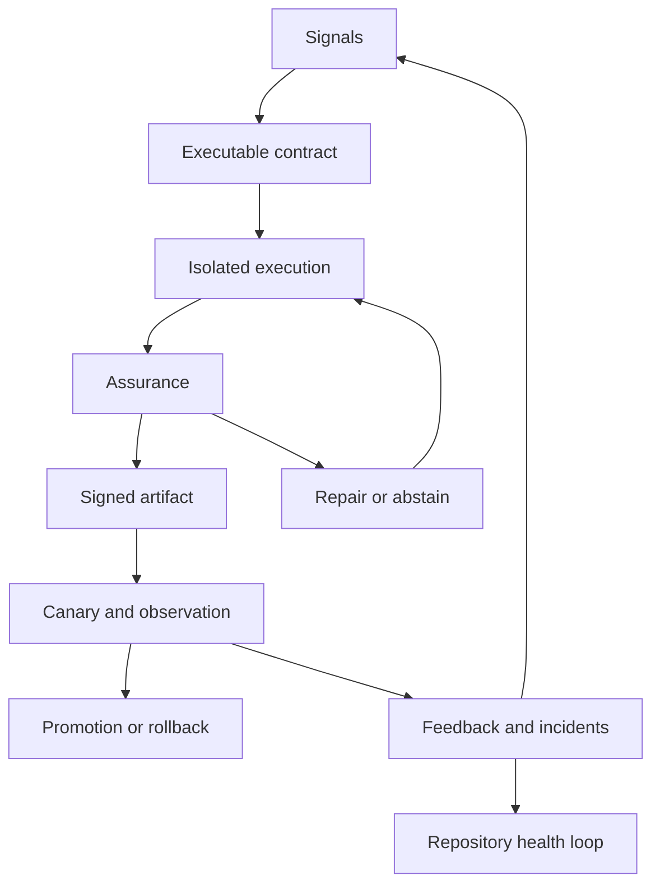

# Proof-Carrying Lights-Off Software Factory Architecture

**Status:** approved implementation specification  
**Baseline:** repository commit `90a4867e3679a84edad5dfc9526d5f5267515ac9`  
**Companion:** [Maintainability Assurance Specification](./maintainability-assurance.md)

## 1. Goal

Build a self-hostable, customizable software factory that can select work, implement it, prove it safe enough, deploy it, observe the outcome, repair or roll it back, and improve its own harness without requiring human code authoring or review.

Lights-off does not mean every task ships. The factory must terminate autonomously in one of four truthful outcomes:

- `succeeded`: evidence met policy and the observed release remained healthy;
- `rolled_back`: release evidence or production observation failed and rollback succeeded;
- `abstained`: the factory could not obtain sufficient evidence within policy/budget;
- `failed`: infrastructure or workflow failure prevented a policy decision.

The system must never relabel `abstained` or `failed` as success.

## 2. Existing foundation to retain

- Temporal is the durable workflow authority.
- Koa is the control-plane API.
- Pi is the coding-agent harness with role-scoped tools and skills.
- Crabbox leases and Git worktrees isolate attempts.
- Hindsight supplies project-scoped memory.
- PostgreSQL is a query projection, not the workflow authority.
- Large evidence goes to an S3-compatible object store.
- GitHub Issues/Projects remain the initial external task surface.

Do not introduce Attractor, Symphony, a second workflow engine, a requirements SaaS, or a vector database into the critical path.

## 3. Research synthesis

### StrongDM

Adopt the seed → validation harness → feedback loop model, end-to-end scenarios, holdout evaluation, trajectory-level satisfaction, dependency twins, filesystem state, shift work, gene transfusion, semports, and reversible pyramid summaries. Do not adopt the assumption that source structure can remain opaque: general-purpose repositories also require evolutionary fitness.

Sources: [principles](https://factory.strongdm.ai/principles), [techniques](https://factory.strongdm.ai/techniques), [DTU](https://factory.strongdm.ai/techniques/dtu), [shift work](https://factory.strongdm.ai/techniques/shift-work), [gene transfusion](https://factory.strongdm.ai/techniques/gene-transfusion), [semport](https://factory.strongdm.ai/techniques/semport), [pyramid summaries](https://factory.strongdm.ai/techniques/pyramid-summaries), and [CXDB](https://factory.strongdm.ai/products/cxdb).

### 8090

Adopt a canonical, bidirectional traceability graph: requirements → blueprints/invariants → work orders → acceptance scenarios → code/tests → artifact/deployment → telemetry/feedback. Store it in versioned repo-local files; build only the minimal API/UI required to inspect it.

Sources: [requirements](https://www.8090.ai/docs/opinions/requirements-writing-guide), [blueprints](https://www.8090.ai/docs/opinions/blueprint-writing-guide), [work orders](https://www.8090.ai/docs/opinions/work-order-writing-guide), [agent work directory](https://www.8090.ai/docs/opinions/agent-skill), and [feedback](https://www.8090.ai/docs/modules/feedback).

### HumanLayer

Adopt phase separation and durable context artifacts: research the repository as-is, produce a detailed plan, implement, then validate the implementation against the plan and acceptance evidence. Replace human approval gates with typed machine policies, independent verifiers, and abstention.

Sources: [Why Software Factories Fail](https://github.com/humanlayer/advanced-context-engineering-for-coding-agents/blob/main/wsff.md) and the [HumanLayer repository](https://github.com/humanlayer/humanlayer).

### OpenAI, Stripe, WorkOS, Brex and other attempts

Adopt repository legibility, short routing documents, structural lints, worktree-local execution, direct CI/operations feedback, isolated task environments, external verification, bounded retries, paved-path tools, canarying, and continuous cleanup. Their public systems still generally retain human review, so the missing piece is evidence policy plus safe autonomous abstention/rollback.

Sources: OpenAI [harness engineering](https://openai.com/index/harness-engineering/) and [Symphony](https://openai.com/index/open-source-codex-orchestration-symphony/), Stripe [Minions](https://stripe.dev/blog/minions-stripes-one-shot-end-to-end-coding-agents), WorkOS [Project Horizon](https://workos.com/blog/project-horizon), and Brex [autonomous agents](https://www.brex.com/journal/building-autonomous-agents-for-technical-tasks) and [simulation testing](https://www.brex.com/journal/articles/simulation-testing-ai-audit-agent).

## 4. System model

The factory has four control planes:

1. **Work plane:** intake, deduplication, dependency/risk classification, prioritization and budgets.
2. **Execution plane:** research, specification, planning, implementation and repair in isolated attempts.
3. **Assurance plane:** deterministic gates, behavioral scenarios, maintainability assurance, security and provenance.
4. **Operations plane:** build, preview, canary, observation, promotion, rollback, incidents and feedback.

The cross-cutting event/evidence spine links every plane.



## 5. End-to-end workflow

The target workflow nodes are:

```text
ingest
classify
prepare_repository
create_worktree
security_scan
scout
specify
architecture_plan
implementation_plan
implement
deterministic_checks
behavioral_verify
maintainability_assess
independent_review
repair_or_refactor (bounded loop)
build_artifact
provenance_verify
preview_deploy
release_verify
canary_deploy
observe
promote | rollback | abstain
feedback_link
cleanup
```

Temporal requirements:

- Node execution is represented by durable attempts, not a `completedNodes` string list.
- Signals create explicit transitions and never only mutate an unused variable.
- Every side-effecting activity has an idempotency key.
- Retry policy depends on typed failure class.
- Policy/security/invalid-task failures are non-retryable.
- Cancellation and cleanup are compensating operations.
- Long workflows use `continueAsNew` with an immutable continuation summary.
- Search attributes include organization, project, repository, task, risk, state and artifact digest.
- Per-repository locks prevent conflicting release branches.
- Global/repository/phase concurrency and budget limits are enforced before work begins.

## 6. Canonical contracts

All node outputs conform to:

```ts
export type Decision = "pass" | "fail" | "abstain";

export interface NodeResult<T> {
  node: FactoryNodeName;
  attemptId: string;
  status: "succeeded" | "failed" | "cancelled";
  output?: T;
  evidenceRefs: readonly string[];
  startedAt: string;
  completedAt: string;
  failure?: FailureEnvelope;
}

export interface GateDecision {
  gateId: string;
  decision: Decision;
  policyVersion: string;
  reasons: readonly GateReason[];
  evidenceRefs: readonly string[];
}

export interface FailureEnvelope {
  type: "transient" | "tool" | "policy" | "security" | "invalid_input" | "budget" | "unknown";
  code: string;
  message: string;
  retryable: boolean;
  evidenceRefs: readonly string[];
}
```

No production activity or agent boundary returns `unknown`. Natural-language output is stored as evidence but cannot substitute for schema-valid output.

## 7. Evidence model

Every evidence item is content-addressed and immutable:

```ts
export interface EvidenceItem {
  id: string;
  kind: "agent_output" | "tool_result" | "test" | "scenario" | "fitness" | "security" | "provenance" | "deployment" | "telemetry" | "incident";
  schemaVersion: string;
  mediaType: string;
  sha256: string;
  uri: string;
  producer: ProducerIdentity;
  subject: EvidenceSubject;
  createdAt: string;
  redaction: "none" | "secrets" | "pii";
}
```

The final `EvidenceManifest` contains source revision, task/requirement IDs, workflow and policy versions, model/prompt/skill/tool versions, sandbox image, diff hash, test/mutation evidence, security/SBOM, scenario trajectories, maintainability report, artifact digest/signature, deployment, observation and rollback target.

PostgreSQL stores queryable metadata and hashes. Object storage holds transcripts, screenshots, recordings, full tool output, dependency graphs and reports. Temporal remains authoritative for execution state.

Required append-only projections:

- `factory_runs`
- `factory_node_attempts`
- `factory_events`
- `agent_sessions`
- `agent_turns`
- `tool_calls`
- `evidence_items`
- `gate_decisions`
- `scenario_runs`
- `fitness_results`
- `artifacts`
- `deployments`
- `deployment_observations`
- `incident_links`
- `feedback_items`
- `oracle_calibrations`

## 8. Executable product contract

Each managed repository may contain:

```text
factory/
  factory.yaml
  requirements/*.md
  blueprints/*.md
  work-orders/*.md
  scenarios/*.yaml
  fitness/*.yaml
  probes/*.yaml
```

Required identifiers:

- `REQ-*` for requirements;
- `INV-*` for architecture and operational invariants;
- `AC-*` for atomic acceptance criteria;
- `SCN-*` for behavioral scenarios;
- `FIT-*` for fitness rules;
- `PRB-*` for maintainability probes.

The factory validates forward and backward coverage. Untraced production changes, uncovered acceptance criteria, stale blueprint links or undeclared public contracts fail the traceability gate.

## 9. Work classification and autonomy policy

```ts
export interface WorkPolicy {
  riskTier: "T0" | "T1" | "T2" | "T3";
  requiredGates: readonly string[];
  requiredCritics: number;
  requiredProbeCount: number;
  maxAgentAttempts: number;
  maxRepairAttempts: number;
  tokenBudget: number;
  wallClockBudgetMs: number;
  canaryPolicy: CanaryPolicy;
  observationPolicy: ObservationPolicy;
}
```

- T0: documentation/generated metadata; deterministic checks.
- T1: contained implementation; behavior plus static maintainability.
- T2: cross-module/API/data changes; independent critics, probes and canary.
- T3: auth/security/destructive migration; multiple independent validators, fault simulation, reversible rollout and longer observation.

Budget exhaustion returns `abstained`, not `failed` or `passed`.

## 10. Behavioral assurance

- The final verifier runs in a separate sandbox and identity.
- Hidden scenarios and graders are mounted read-only after implementation.
- Implementers cannot access hidden scenarios, probes or evaluator prompts.
- Behavior-changing tests normally fail on base and pass on candidate.
- Refactor-only tests pass on both.
- Scenarios exercise external APIs/browser/user journeys rather than private functions.
- Nondeterministic scenarios run repeatedly and yield a satisfaction distribution.
- Dependency twins are deterministic, replayable and versioned.
- The verifier stores the full trajectory and machine-readable outcome.

Initial scenario types: HTTP/API, CLI, browser, contract, migration/rollback, failure recovery, load budget and security policy.

## 11. Maintainability assurance

Implement the companion specification exactly. The release gate combines repository fitness rules, structural/history sensors, an independent critic, sampled counterfactual future-change probes and longitudinal calibration. No aggregate static score or LLM judgment may pass or fail a release by itself.

## 12. Agent roles and isolation

Required roles:

- `scout`: read-only repository and external research;
- `specifier`: converts task evidence into immutable work order/acceptance IDs;
- `architect`: produces blueprint-impact and invariant plan;
- `planner`: exact implementation/test plan;
- `implementer`: write access, no hidden evaluators;
- `repairer`: finding-scoped write access;
- `maintainability_critic`: read-only structural/evolution review;
- `behavior_verifier`: separate sandbox/identity, hidden scenarios;
- `release_verifier`: validates built artifact as external client;
- `retrospective`: analyzes completed trajectory and proposes harness improvements.

Each role declares tools, network policy, filesystem policy, model route, skills, memory operations, token/time budget and allowed evidence kinds.

## 13. Observability

Instrument with OpenTelemetry and preserve a typed agent-turn DAG.

Correlation keys:

```text
organization_id project_id repository_id task_id workflow_id run_id
attempt_id node_id agent_session_id source_commit artifact_digest
deployment_id scenario_id probe_id
```

Control-plane signals: queue latency, node duration, retries, stalls, cancellations, heartbeat failures, workflow history size, cleanup failures and concurrency.

Agent signals: model/prompt/skill versions, turns, tool calls, tool failures, context size, compaction, tokens, cost, files touched, denied actions, findings and disagreement.

Outcome signals: scenario satisfaction, mutation result, maintainability vector/delta, probe cost, artifact provenance, canary health, rollback, incidents, feedback and subsequent maintenance cost.

Development deployment uses OTel Collector plus Grafana LGTM. Production may split Prometheus/Mimir, Loki, Tempo and Grafana. Temporal UI remains the workflow debugger. All instrumentation stays vendor-neutral.

## 14. Supply chain and sandbox security

- Pin package, tool, agent, worker and sandbox versions; remove `latest` from production dependencies/images.
- Default-deny network, then grant role-specific allowlists.
- Use short-lived workload identities and scoped credentials.
- Keep the orchestrator outside untrusted coding/verifier sandboxes.
- Treat repository files, issues, web content and tool output as untrusted prompt input.
- Derive the artifact digest from actual build output.
- Generate SBOM and provenance; sign the immutable digest.
- Build once and promote the same digest.
- Record all credential/tool capabilities in the manifest without storing secrets.
- Run security and policy evaluators independently from implementation agents.

## 15. Release controller

Release states:

```text
built -> provenance_verified -> preview -> release_verified -> canary
canary -> observing -> promoted
canary|observing -> rolling_back -> rolled_back
any assurance state -> abstained
```

The observation window evaluates technical SLOs and semantic product signals. A liveness endpoint alone cannot promote a release. Rollback is idempotent and itself observed. `Done` is written to the external task tracker only after promotion and completion of the configured observation window.

## 16. Feedback and self-improvement

Ingest incidents, user feedback, scenario failures, tool errors, repeated repair classes, context misses, flaky checks and unnecessary repeated commands. Cluster them with exact source evidence, then create work orders for product code or the factory harness.

Factory changes use a separate meta-evaluation pipeline:

1. replay a versioned corpus of historical tasks;
2. run held-out tasks and adversarial/gaming agents;
3. compare success, cost, variance, incidents and maintainability outcomes;
4. shadow the new evaluator/model/prompt/policy;
5. canary it on low-risk tasks;
6. promote or revert it.

Per-role model routing is empirical. Keep a weather report by role/task/risk, but do not hardcode today's model rankings in workflow code.

## 17. Repository-health loop

Run outside the release critical path. It:

- updates hotspots and co-change graphs;
- executes the broad hidden probe bank;
- detects architecture/documentation drift;
- grades repository health by vector and trend;
- creates small evidence-backed cleanup work orders;
- runs repairs through the same behavioral and release gates;
- measures whether cleanup lowered real later change cost.

It must not produce sweeping aesthetic rewrites or combine unrelated cleanup.

## 18. Minimum operator surfaces

Before a custom UI, expose:

- Temporal UI for durable execution;
- Grafana dashboards for factory/product telemetry;
- Koa endpoints for run state, graph, evidence manifest, evidence item, gate decisions, scenario/probe results, deployment and rollback;
- GitHub issue comments/status updates containing concise outcome and stable evidence links.

A later UI may add a run graph, trajectory viewer, live sandbox, diff, assurance vector and production correlation, but it is not on the initial critical path.

## 19. Non-goals

- guaranteeing that every task can ship;
- treating test pass, code review prose or a quality score as proof;
- auto-refactoring an entire repository during a feature change;
- reproducing 8090's full product-management UI;
- depending on one model/provider/analyzer;
- permitting the factory to change its evaluator and immediately grade itself with that evaluator;
- hiding failed or abstained runs.

## 20. Global acceptance criteria

- Every workflow transition is durable, typed and queryable.
- Every success state has an immutable evidence manifest.
- Every gate supports `pass`, `fail` and `abstain`.
- Every side effect is idempotent or fenced.
- Implementer and final verifier are isolated.
- Hidden evaluators cannot be modified by the candidate.
- Candidate artifact digest is derived, signed and deployed unchanged.
- A release can canary, observe and automatically roll back.
- Production outcomes link back to the originating task/run/artifact.
- Maintainability uses multiple evidence classes and is calibrated against future changes.
- The system can operate self-hosted with no mandatory proprietary control plane.

